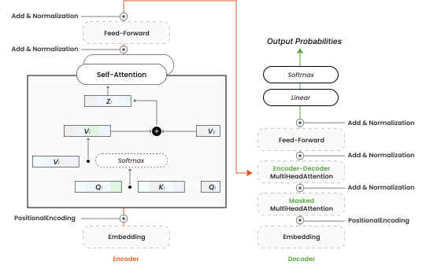

# NumPy-based Transformer Model Implementation (Work in Progress)

This project aims to build a Transformer model from scratch using only the NumPy library in Python. The Transformer model is widely used in the field of Natural Language Processing (NLP) for tasks such as machine translation, text summarization, and other sequence-to-sequence applications. Initiated for educational purposes, this project serves as a resource for developers seeking to understand the inner workings of deep learning models through NumPy.

## Project Overview

The main goal is to provide a clear and detailed implementation of the Transformer model, highlighting the core components such as attention mechanisms, positional encoding, and the overall architecture including encoder and decoder stacks. By limiting the project to NumPy, we emphasize the fundamental mathematics and algorithms that drive these models, offering deep insights into their functionality.

